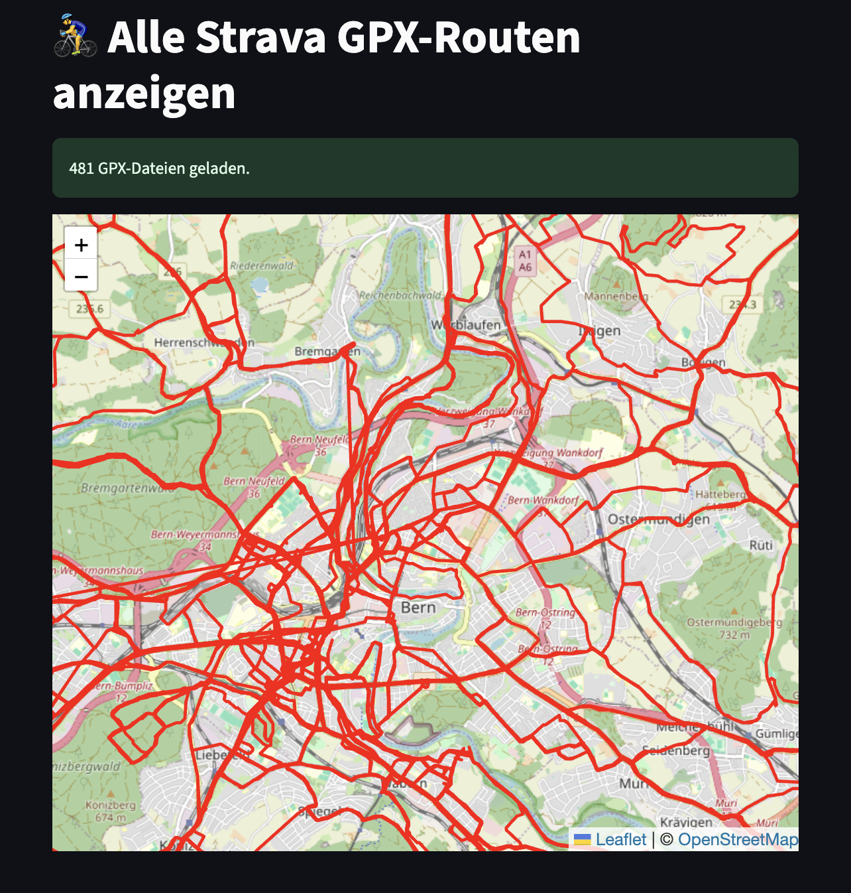

# 🚴 GPX Viewer & FIT-Konverter

[](https://streamlit.io/)
[](LICENSE)
[](https://www.python.org/)
[](https://www.strava.com/)

Ein kleines Streamlit-Tool zur Anzeige von GPX-Routen (z. B. aus Strava) auf einer interaktiven Karte – plus Konverter für `.fit(.gz)` → `.gpx`.

---

## ✨ Features

- Lädt und visualisiert beliebig viele GPX-Dateien
- Nutzt `folium` für Kartenanzeige in Streamlit
- Optionaler Konverter von `.fit` oder `.fit.gz` zu `.gpx`
- Anzeige aller Routen auf einer gemeinsamen Karte mit interaktivem Zoom

---

## 📸 Vorschau

https://gpx-viewer.streamlit.app/



---

## 📤 Strava-Aktivitäten exportieren und verwenden

### 🏃‍♂️ Aktivitäten exportieren

1. Öffne [strava.com/settings/profile](https://www.strava.com/settings/profile)
2. Gehe zu **My Account** → **Download or Delete Your Account**
3. Klicke auf **Get Started** unter **Download Request**
4. Lade das ZIP aus der E-Mail herunter
5. Entpacke es – die Aktivitäten liegen im Ordner `activities/` als `.fit.gz`, `.gpx` oder `.tcx`

### 🗺️ Dateien mit diesem Tool verwenden

1. Lade `.fit.gz` oder `.gpx`-Dateien in die App
2. `.fit.gz` werden automatisch in `.gpx` konvertiert
3. Die GPX-Routen erscheinen auf der Karte

---

## 🚀 Lokales Setup

```bash
pip install -r requirements.txt
streamlit run gpx_viewer.py
